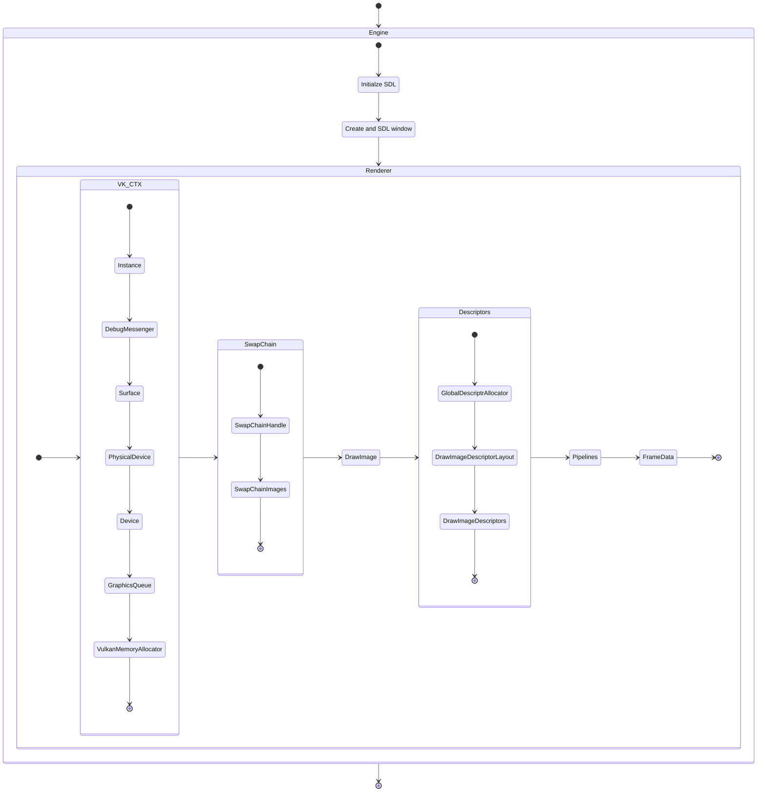
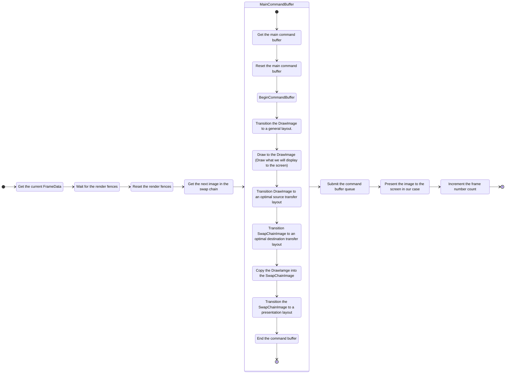

Zig Vulkan Dev - Example
========================

# Synopsis

This code is used by me to learn vulkan from [https://vkguide.dev](https://vkguide.dev), with the obvious difference being that I followed it along in [Zig](https://ziglang.org/).

> [!NOTE]
> Code is currently up to Chapter 2 Drawing With Compute, Subsection 3 Vulkan Shaders - Code.

# Dependencies

All dependecies are handled by the zig package manager, so just cloning the repo and running `zig build run` [SHOULD](https://datatracker.ietf.org/doc/html/rfc2119#section-3) work.

- [zig-sdl3](https://github.com/Gota7/zig-sdl3) Zig bindings for [SDL3](https://github.com/libsdl-org/SDL).
- [vulkan-zig](https://github.com/Snektron/vulkan-zig) Zig bidnings for [https://www.vulkan.org/](https://www.vulkan.org/).
- [Vulkan-Headers](https://github.com/KhronosGroup/Vulkan-Headers) The official [Khronos](https://www.khronos.org/) vulkan header files and API registry.
- [zig_vma](https://github.com/MakeItEnd/zig_vma) Zig bindings for [VulkanMemoryAllocator](https://github.com/GPUOpen-LibrariesAndSDKs/VulkanMemoryAllocator).

# Observations

## Learning resources

While my first vulkan attempt years ago was, what I think was the first Vulkan tutorial on the internet, [https://vulkan-tutorial.com/](https://vulkan-tutorial.com/) it appears that it was left out of date and then cloned and updated by Khronos group at [https://docs.vulkan.org/tutorial/latest/00_Introduction.html](https://docs.vulkan.org/tutorial/latest/00_Introduction.html). But from my understanding that is also no longer "up to date" as it uses an old rendering method that uses [Render Pass](https://docs.vulkan.org/spec/latest/chapters/renderpass.html) which is now deprecated, and mainly used on old Android devices that are stuck with the older API version of Vulkan.

Since then [https://vkguide.dev/](https://vkguide.dev/) seems to be the place to go for devs who are new to Vulkan. That being said I still recommend going trough [https://docs.vulkan.org/tutorial/latest/00_Introduction.html](https://docs.vulkan.org/tutorial/latest/00_Introduction.html) at least once not only to learn form it but also it shows you how to manually set up things like the vulkan instance, and logical device, things which the vkguide abstracts away using [vk-bootstrap](https://github.com/charles-lunarg/vk-bootstrap).

Another good source for learning are [Sascha Willems](https://www.saschawillems.de/) excelent [Vulkan Examples](https://github.com/SaschaWillems/Vulkan).

And for more preactice the official website [www.vulkan.org](https://www.vulkan.org/learn#key-resources) offers a lot of resources like the [Guide](https://docs.vulkan.org/guide/latest/index.html) and of course [The Official Documentation](https://docs.vulkan.org/spec/latest/chapters/introduction.html)

## Complexity

While vulkan is a lot to take in at first, once you structure together elements of the API that work together, it becomes much clearer that it's more complex then complicated. (I'm sure there are more complicated stuff once you deal with more advanced parts of the API but just to get it up and running it's reasonable.)

# Structure

All the code is in the the project library and the executable just initalzies and runs the engine from it.

## Rendering process

